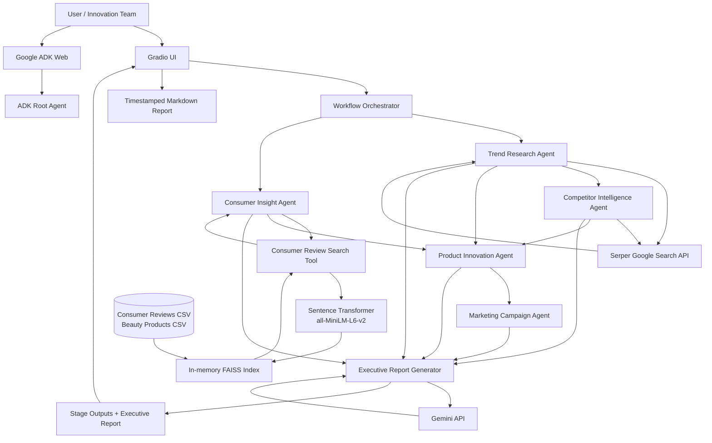

# 💄 Beauty Trend & Product Innovation AI

An agentic Generative AI proof of concept that transforms live beauty-market signals, consumer feedback, and competitor intelligence into a differentiated product concept, marketing campaign, and executive innovation report.

The application is built with **Google Agent Development Kit (ADK)**, **Gemini**, **Serper Google Search**, **FAISS**, **Sentence Transformers**, and **Gradio**.

> **Project status:** Local POC/demo. No cloud deployment is included.

---

## Table of Contents

- [Business Problem](#business-problem)ß
- [Solution Overview](#solution-overview)
- [Key Features](#key-features)
- [Architecture](#architecture)
- [Agent Responsibilities](#agent-responsibilities)
- [End-to-End Workflow](#end-to-end-workflow)
- [Technology Stack](#technology-stack)
- [Project Structure](#project-structure)
- [Prerequisites](#prerequisites)
- [Installation](#installation)
- [Environment Configuration](#environment-configuration)
- [Run the Gradio Application](#run-the-gradio-application)
- [Run with ADK Web](#run-with-adk-web)
- [Run Tests](#run-tests)
- [Example Use Case](#example-use-case)
- [Outputs](#outputs)
- [Design Decisions](#design-decisions)
- [Current Limitations](#current-limitations)
- [Recommended Enhancements](#recommended-enhancements)
- [Troubleshooting](#troubleshooting)

---

## Business Problem

Beauty innovation teams must continuously evaluate:

- emerging beauty and consumer trends;
- changing customer preferences and pain points;
- competitor positioning and common product features;
- potential market whitespace;
- differentiated product opportunities;
- campaign directions for a target audience and geography.

This work is often spread across disconnected research sources, consumer reviews, spreadsheets, and manual workshops. The project demonstrates how multiple specialized AI agents can collaborate to accelerate early-stage innovation discovery.

---

## Solution Overview

The user provides an innovation brief containing:

- beauty category;
- target audience;
- target market;
- business innovation question.

The system then executes a sequential multi-agent workflow:

1. researches live beauty trends;
2. retrieves relevant consumer and product evidence from a FAISS knowledge base;
3. analyzes competitor patterns and potential whitespace;
4. creates one differentiated product concept;
5. develops a concise marketing campaign;
6. synthesizes all outputs into an executive report.

The same project can be used through:

- a polished local **Gradio UI**; or
- **Google ADK Web** for direct agent testing.

---

## Key Features

- Five purpose-built Gemini agents orchestrated with Google ADK.
- Live beauty and competitor research through Serper Google Search.
- Local Retrieval-Augmented Generation using Sentence Transformers and FAISS.
- Sequential context passing between research, strategy, innovation, and campaign stages.
- Structured Markdown outputs for each agent.
- Executive report synthesis using Gemini.
- Downloadable timestamped Markdown report.
- Gradio tabs for inspecting every workflow stage.
- Standalone scripts for component and end-to-end testing.
- Environment-based configuration with secrets excluded from source control.

---

## Architecture



A detailed architecture description is available in [`architecture.md`](architecture.md).

---

## Agent Responsibilities

| Agent | Primary responsibility | Tools / inputs | Main output |
|---|---|---|---|
| Trend Research Agent | Identify current beauty trends and innovation signals | Serper live search | Trend intelligence |
| Consumer Insight Agent | Extract needs, pain points, desired features, and positive signals | FAISS consumer/product retrieval | Consumer insight summary |
| Competitor Intelligence Agent | Analyze patterns, common features, differentiation, and possible gaps | Trend context plus Serper search | Competitor intelligence |
| Product Innovation Agent | Combine all evidence into one strongest product idea | Trend, consumer, and competitor outputs | Product innovation concept |
| Marketing Campaign Agent | Translate the product concept into a launch-friendly campaign | Product concept, audience, and market | Campaign concept |
| Executive Report Generator | Synthesize all stages into a concise business report | All agent outputs | Executive innovation report |

### ADK Web Root Agent

`beauty_innovation_adk/agent.py` exposes a separate conversational root agent for ADK Web. It directly uses:

- `search_beauty_trends`; and
- `search_consumer_reviews`.

This path is useful for interactive agent/tool testing. The Gradio application uses the complete five-agent orchestration service.

---

## End-to-End Workflow

```text
Innovation Brief
      │
      ▼
1. Trend Research Agent
   └─ Live Serper search
      │
      ▼
2. Consumer Insight Agent
   └─ Local FAISS semantic retrieval
      │
      ▼
3. Competitor Intelligence Agent
   └─ Trend context + live competitor search
      │
      ▼
4. Product Innovation Agent
   └─ Synthesizes trend, consumer, and competitor evidence
      │
      ▼
5. Marketing Campaign Agent
   └─ Converts product strategy into campaign direction
      │
      ▼
6. Executive Report Generator
   └─ Gemini synthesis of all outputs
      │
      ▼
Gradio Results + Downloadable Markdown Report
```

Each ADK agent is executed in a dedicated in-memory session created by `InMemoryRunner`. A unique session ID is generated for every stage, and only the final text response is passed to the next stage.

---

## Technology Stack

| Layer | Technology |
|---|---|
| Agent framework | Google Agent Development Kit (`google-adk`) |
| Large language model | Gemini via `google-genai` |
| Live web search | Serper API |
| Embedding model | `sentence-transformers/all-MiniLM-L6-v2` |
| Vector database | FAISS `IndexFlatL2` |
| Data processing | Pandas, NumPy |
| User interface | Gradio Blocks |
| Configuration | `python-dotenv` |
| Local data | CSV files |
| Report format | Markdown |
| Runtime | Python |

---

## Project Structure

```text
.
├── app.py                         # Main Gradio application entry point
├── README.md                      # Project documentation
├── architecture.md                # Detailed architecture and data flow
├── requirements.txt               # Python dependencies
├── .gitignore                     # Files excluded from Git
│
├── agents/
│   ├── trend_agent.py             # Live trend research agent
│   ├── consumer_agent.py          # FAISS-backed consumer insight agent
│   ├── competitor_agent.py        # Competitor and whitespace agent
│   ├── innovation_agent.py        # Product concept generation agent
│   └── campaign_agent.py          # Marketing campaign agent
│
├── beauty_innovation_adk/
│   ├── __init__.py                # Exposes root_agent
│   └── agent.py                   # ADK Web conversational root agent
│
├── services/
│   ├── config.py                  # Environment loading and validation
│   ├── vector_store.py            # Data loading, embeddings, and FAISS search
│   ├── orchestration.py           # Sequential multi-agent workflow
│   └── report_generator.py        # Gemini executive report synthesis
│
├── tools/
│   └── search_tool.py             # Serper live-search ADK function tool
│
├── ui/
│   └── gradio_app.py              # Gradio layout, workflow call, report download
│
├── data/
│   ├── consumer_reviews.csv       # Consumer review knowledge base
│   └── beauty_products.csv        # Product feature knowledge base
│
└── scripts/
    ├── test_vector_store.py
    ├── test_trend_agent.py
    ├── test_consumer_agent.py
    ├── test_competitor_agent.py
    ├── test_innovation_agent.py
    ├── test_campaign_agent.py
    ├── test_report_generator.py
    └── test_orchestration.py
```

The application creates an `outputs/` directory automatically when a report is generated.

---

## Prerequisites

- Python 3.10 or newer is recommended.
- A Google Gemini API key.
- A Serper API key.
- Internet access for Gemini, Serper, and the initial Sentence Transformer model download.
- macOS, Linux, or Windows.

> FAISS installation can vary by operating system and Python version. Python 3.10–3.12 generally provides the smoothest local setup.

---

## Installation

### 1. Clone or extract the project

```bash
git clone <your-repository-url>
cd <project-directory>
```

For a downloaded ZIP, extract it and open Terminal in the extracted project root.

### 2. Create a virtual environment

#### macOS / Linux

```bash
python3 -m venv .venv
source .venv/bin/activate
```

#### Windows PowerShell

```powershell
python -m venv .venv
.\.venv\Scripts\Activate.ps1
```

### 3. Upgrade packaging tools

```bash
python -m pip install --upgrade pip setuptools wheel
```

### 4. Install dependencies

```bash
pip install -r requirements.txt
```

---

## Environment Configuration

Create a `.env` file in the project root:

```bash
touch .env
```

Add the following values:

```env
APP_NAME=beauty_trend_innovation_agent
APP_ENV=local
GOOGLE_API_KEY=your_google_gemini_api_key
SERPER_API_KEY=your_serper_api_key
GEMINI_MODEL=gemini-3.1-flash-lite
```

Do not commit `.env`. It is already excluded by `.gitignore`.

Validate the configuration:

```bash
python services/config.py
```

Expected result:

```text
Google API   : Configured
Serper API   : Configured
```

If the configured Gemini model is unavailable for your account or region, replace `GEMINI_MODEL` with a model accessible to your API key.

---

## Run the Gradio Application

From the project root:

```bash
python app.py
```

Open:

```text
http://127.0.0.1:7860
```

The UI allows you to:

1. choose Makeup, Skincare, or Haircare;
2. enter a target audience;
3. enter a target market;
4. provide an innovation question;
5. execute the complete workflow;
6. inspect each stage in separate tabs;
7. download the final executive report as Markdown.

### Use a different Gradio port

The current application uses port `7860`. If that port is occupied, either stop the existing process or change `server_port` in `app.py`.

On macOS/Linux, find the process with:

```bash
lsof -i :7860
```

Then stop it with:

```bash
kill -9 <PID>
```

---

## Run with ADK Web

Activate the virtual environment and run ADK Web with the project root as the agents directory:

```bash
adk web .
```

Open the URL printed by ADK, commonly:

```text
http://127.0.0.1:8000
```

Select the `beauty_innovation_adk` agent package.

Example prompt:

```text
What consumer problems do people have with everyday makeup in India, and what differentiated product opportunity could address them?
```

> ADK Web exercises the conversational root agent. To run the full five-agent pipeline, use the Gradio application or `scripts/test_orchestration.py`.

---

## Run Tests

All commands should be executed from the project root with the virtual environment active.

### Test the local FAISS knowledge base

```bash
python scripts/test_vector_store.py
```

### Test individual agents

```bash
python scripts/test_trend_agent.py
python scripts/test_consumer_agent.py
python scripts/test_competitor_agent.py
python scripts/test_innovation_agent.py
python scripts/test_campaign_agent.py
```

### Test the executive report generator

```bash
python scripts/test_report_generator.py
```

### Test the complete workflow

```bash
python scripts/test_orchestration.py
```

### Optional syntax validation

```bash
python -m compileall agents services tools ui beauty_innovation_adk scripts app.py
```

The uploaded project passed Python syntax compilation during documentation generation. This does not validate API keys, network connectivity, model access, or live tool responses.

---

## Example Use Case

### Input

```text
Category: Makeup
Target Audience: Gen Z
Market: India

Business Question:
Identify emerging everyday makeup opportunities and suggest a differentiated
product concept for consumers who prefer lightweight, natural, and
multi-benefit beauty products.
```

### Expected output stages

1. **Beauty Trend Intelligence**
   - emerging trends;
   - consumer behavior signals;
   - product feature signals;
   - innovation implications.

2. **Consumer Insight Summary**
   - top needs;
   - pain points;
   - desired features;
   - positive signals;
   - product opportunity.

3. **Competitor Intelligence**
   - relevant patterns;
   - common market features;
   - less-common differentiators;
   - potential market gaps;
   - whitespace summary.

4. **Product Innovation Concept**
   - product name and category;
   - target consumer and problem;
   - product concept and key features;
   - ingredient or technology direction;
   - differentiation and value proposition;
   - innovation confidence.

5. **Marketing Campaign Concept**
   - campaign name and idea;
   - core message;
   - channels and content ideas;
   - influencer activation;
   - suggested hashtags.

6. **Executive Beauty Innovation Report**
   - opportunity;
   - strategic rationale;
   - product and campaign direction;
   - business value;
   - recommended next steps;
   - executive takeaway.

---

## Outputs

The workflow returns a `BeautyInnovationResult` dataclass containing:

```python
trend_insights
consumer_insights
competitor_insights
product_concept
campaign_concept
executive_report
```

The Gradio application also saves the final report to:

```text
outputs/beauty_innovation_report_YYYYMMDD_HHMMSS.md
```

Generated reports are excluded from Git by `.gitignore`.

---

## Design Decisions

### Sequential orchestration

The workflow is intentionally sequential because later stages depend on evidence generated earlier. This makes the reasoning path easy to explain in a project demonstration and straightforward to debug.

### Specialized agents

Each agent has a narrowly defined instruction and output schema. This reduces prompt ambiguity and keeps the final outputs presentation-friendly.

### Live search plus local RAG

The project separates two knowledge types:

- **current external signals** are retrieved through Serper;
- **controlled internal evidence** is retrieved from local CSV data through FAISS.

This hybrid design demonstrates how enterprise systems can combine live market intelligence with proprietary consumer data.

### In-memory sessions and vector index

ADK sessions and the FAISS index are rebuilt in memory. This is appropriate for a local POC and avoids infrastructure dependencies, but it is not optimized for concurrent production traffic.

### Evidence-sensitive prompts

Agent instructions explicitly discourage invented statistics, unsupported scientific claims, and unverified market conclusions. Potential gaps are framed as hypotheses requiring validation.

---

## Current Limitations

- The bundled CSV knowledge base is small and intended only for demonstration.
- The vector index is rebuilt whenever `create_beauty_vector_store()` is called.
- `all-MiniLM-L6-v2` may be downloaded on the first run.
- The retrieval method uses L2 distance without reranking or metadata filtering.
- Agent execution is sequential and may have noticeable latency.
- Sessions are in memory and are not durable.
- There is no authentication, authorization, user management, or audit trail.
- There is no prompt/version registry, evaluation pipeline, tracing, or cost monitoring.
- Live search quality depends on Serper and external web content.
- The current Serper search configuration is fixed to India (`gl=in`, `hl=en`) even when another market is entered.
- No formal human-in-the-loop approval gate is implemented.
- No deployment assets are included.
- Generated concepts are hypotheses, not validated product, legal, regulatory, scientific, or medical recommendations.

---

## Recommended Enhancements

1. Add a human approval checkpoint before product and campaign generation.
2. Cache the embedding model and persist the FAISS index.
3. Add metadata filters for category, rating, segment, and market.
4. Replace fixed search geography with a market-to-country-code mapping.
5. Add source citations to the final trend and competitor outputs.
6. Add retry, timeout, rate-limit, and fallback handling for model/API calls.
7. Add structured logging, OpenTelemetry traces, token usage, latency, and cost metrics.
8. Add automated evaluation for groundedness, relevance, completeness, and safety.
9. Store sessions and reports in a durable database or object store.
10. Add FastAPI endpoints and containerization for deployment.
11. Add authentication, RBAC, secret management, and audit logging.
12. Add parallel execution where dependencies permit.

---

## Troubleshooting

### `GOOGLE_API_KEY is not configured`

Confirm `.env` exists in the project root and contains:

```env
GOOGLE_API_KEY=your_key
```

Then restart the application.

### `SERPER_API_KEY is not configured`

Add the Serper key to `.env`:

```env
SERPER_API_KEY=your_key
```

### Gemini model not found or unavailable

Change the model in `.env` to one available for your account:

```env
GEMINI_MODEL=<available-model-name>
```

### Port 7860 is already in use

Stop the existing process or update `server_port` in `app.py`.

### FAISS installation failure

Use a supported Python version and reinstall in a clean environment:

```bash
python3.11 -m venv .venv
source .venv/bin/activate
python -m pip install --upgrade pip setuptools wheel
pip install -r requirements.txt
```

### Sentence Transformer model download issue

Verify internet access. The first vector-store run downloads `all-MiniLM-L6-v2` unless it is already cached.

### Agent returns no final response

Check:

- Gemini API access and quota;
- selected model availability;
- network connectivity;
- ADK and `google-genai` compatibility;
- terminal logs for upstream errors.

---

## Responsible Use

This project is an innovation-assistance POC. Its outputs should be reviewed by qualified product, consumer research, legal, regulatory, safety, claims, and formulation teams before business use. The system must not be treated as proof of market demand or as a source of medical or scientific claims.

---

## License

No license file is currently included. Add an appropriate license before public or commercial distribution.
